<table>
  <tr>
    <td align="center">
      
  <h3 align="left">Introduction</h3>
  

   I'm $\color{#A9BACC}Daseul$, Frontend engineer focused on scalable, data-driven applications with React and TypeScript. I build maintainable systems with predictable state management and clean architecture. :four_leaf_clover: 

 

  <h3 align="left">Studying</h3>
  

    
  
  
  
  
  
  
  

  
  
  
  
  
  
  

 
  
  

  
  
  
  

 
 

  <h3 align="left">GitHub Stats</h3>

  <picture>
  <source media="(prefers-color-scheme: dark)" srcset="./profile/stats-dark.svg">
  <source media="(prefers-color-scheme: light)" srcset="./profile/stats-light.svg">
  
</picture>

 
 

  <h3 align="left">Most Used Languages</h3>

<picture>
  <source media="(prefers-color-scheme: dark)" srcset="./profile/top-langs-dark.svg">
  <source media="(prefers-color-scheme: light)" srcset="./profile/top-langs-light.svg">
  
</picture>

 
 
 

  
 
</td>
    <td align="center">
       <h3 align="left">Team Projects</h3>

<picture>
  <source media="(prefers-color-scheme: dark)" srcset="./profile/pin-jober-dark.svg">
  <source media="(prefers-color-scheme: light)" srcset="./profile/pin-jober-light.svg">
  
</picture>

<picture>
  <source media="(prefers-color-scheme: dark)" srcset="./profile/pin-doctorcal-client-dark.svg">
  <source media="(prefers-color-scheme: light)" srcset="./profile/pin-doctorcal-client-light.svg">
  
</picture>

<picture>
  <source media="(prefers-color-scheme: dark)" srcset="./profile/pin-doctorcal-admin-dark.svg">
  <source media="(prefers-color-scheme: light)" srcset="./profile/pin-doctorcal-admin-light.svg">
  
</picture>

<picture>
  <source media="(prefers-color-scheme: dark)" srcset="./profile/pin-savewallet-dark.svg">
  <source media="(prefers-color-scheme: light)" srcset="./profile/pin-savewallet-light.svg">
  
</picture>

<picture>
  <source media="(prefers-color-scheme: dark)" srcset="./profile/pin-beauty-client-dark.svg">
  <source media="(prefers-color-scheme: light)" srcset="./profile/pin-beauty-client-light.svg">
  
</picture>

<picture>
  <source media="(prefers-color-scheme: dark)" srcset="./profile/pin-beauty-admin-dark.svg">
  <source media="(prefers-color-scheme: light)" srcset="./profile/pin-beauty-admin-light.svg">
  
</picture>

 
 
 

  <h3 align="left">Personal Projects</h3>

<picture>
  <source media="(prefers-color-scheme: dark)" srcset="./profile/pin-profile-dark.svg">
  <source media="(prefers-color-scheme: light)" srcset="./profile/pin-profile-light.svg">
  
</picture>

  </td>
  </tr>
</table>
